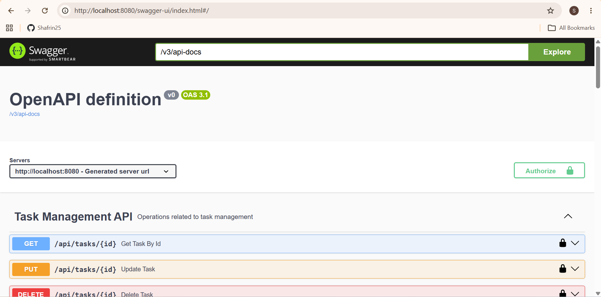
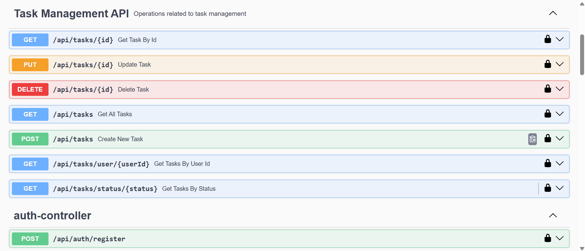
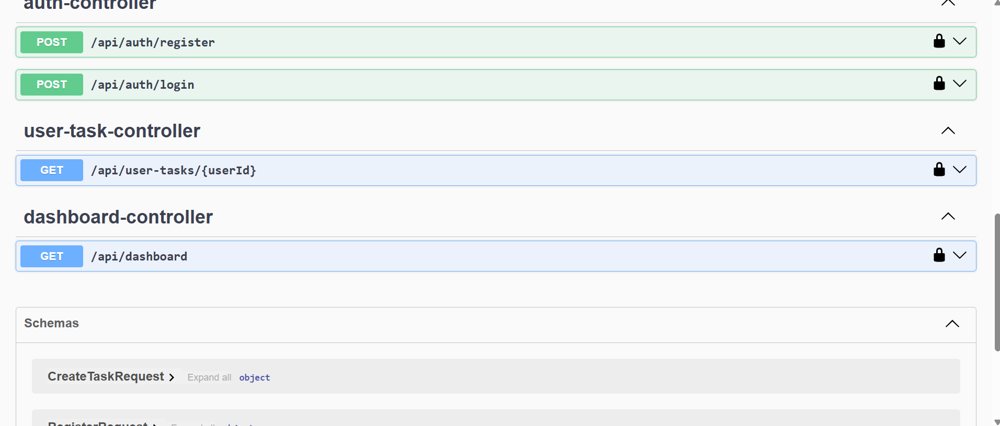
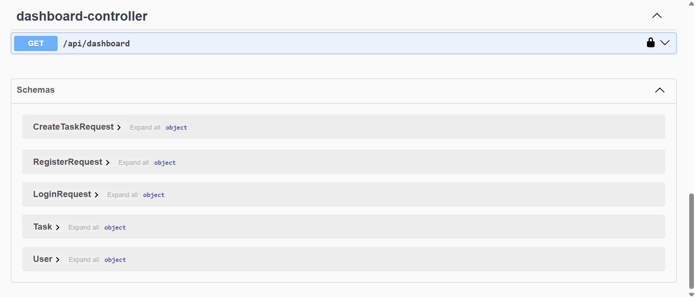

# Task Management System API

A Spring Boot REST API for task management with JWT Authentication, Role-Based Authorization, MySQL, Swagger Documentation, and Docker support.

## Features

* User Registration
* User Login with JWT Authentication
* Role-Based Access Control (ADMIN, USER)
* Create Task
* Get All Tasks
* Get Task By ID
* Get Tasks By User ID
* Update Task
* Delete Task
* Swagger API Documentation
* Docker Containerization
* MySQL Database Integration

## Tech Stack

* Java 17
* Spring Boot
* Spring Security
* JWT
* Spring Data JPA
* MySQL
* Swagger OpenAPI
* Docker
* Maven
* Java 21
* Spring Boot 3
* Spring Security
* JWT (JSON Web Token)
* Spring Data JPA
* MySQL
* Maven
* Swagger OpenAPI
* Docker
* Git & GitHub

## Project Structure

```text
src
├── controller
├── service
├── repository
├── entity
├── dto
├── security
└── config
```

## API Endpoints

### Authentication

POST /api/auth/register

POST /api/auth/login

### Tasks

GET /api/tasks

GET /api/tasks/{id}

GET /api/tasks/user/{userId}

POST /api/tasks

PUT /api/tasks/{id}

DELETE /api/tasks/{id}

## Swagger UI

http://localhost:8080/swagger-ui/index.html

## Docker

Build:

docker build -t taskmanagementapi .

Run:

docker run -p 8080:8080 taskmanagementapi

## Author

Shafrin M
| Method | Endpoint           |
| ------ | ------------------ |
| POST   | /api/auth/register |
| POST   | /api/auth/login    |

### Tasks

| Method | Endpoint                   |
| ------ | -------------------------- |
| GET    | /api/tasks                 |
| GET    | /api/tasks/{id}            |
| POST   | /api/tasks                 |
| PUT    | /api/tasks/{id}            |
| DELETE | /api/tasks/{id}            |
| GET    | /api/tasks/status/{status} |
| GET    | /api/tasks/user/{userId}   |

### Dashboard

| Method | Endpoint       |
| ------ | -------------- |
| GET    | /api/dashboard |

## Swagger Documentation

Swagger UI is available at:

```text
http://localhost:8080/swagger-ui/index.html
```

## Screenshots

### Swagger UI



### Task APIs



### Authentication APIs



### Dashboard API



## Running the Project

### Clone Repository

```bash
git clone https://github.com/ShafrinSulthan/task-management-system-springboot.git
cd task-management-system-springboot
```

### Run Application

```bash
mvn spring-boot:run
```

### Docker

```bash
docker build -t taskmanagementapi .
docker run -p 8080:8080 taskmanagementapi
```

## Author

**Shafrin M**

GitHub: https://github.com/ShafrinSulthan
